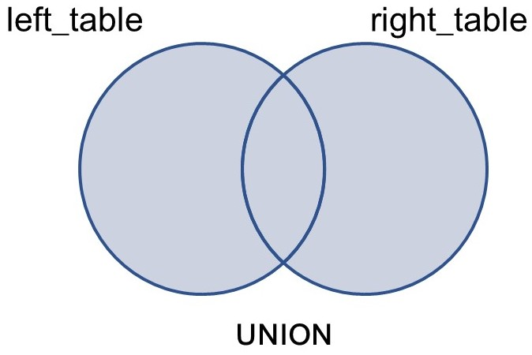
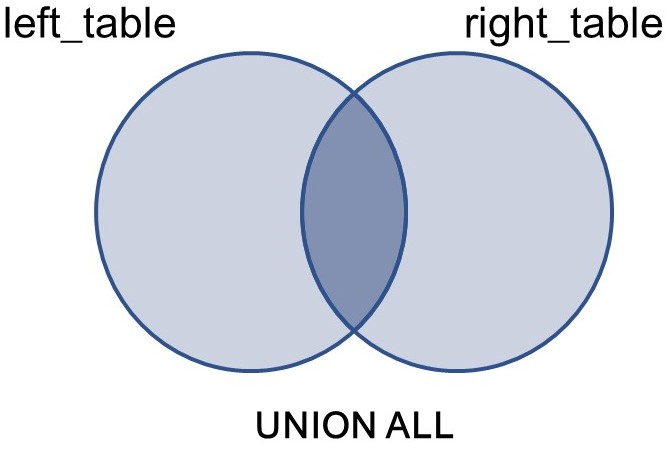
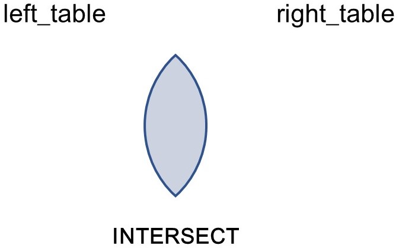
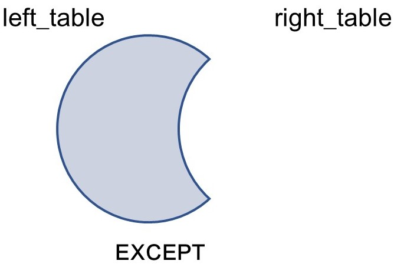

# SQL_Intermediate
[SQL Intermediate Tutorial](https://discoverdata.github.io/SQL_Intermediate)

Welcome
=======

------------------------------------------------------------------------

Hi, I am **Varun Khanna** and welcome to my free tutorial on
**Intermediate **. Mastering SQL
or *sequel* is an essential skill in a data scientist's toolbox. In this
tutorial, you will learn to use **aggregate functions** like COUNT, MAX,
AVG, SUM. You will find out how to perform complex operations using
**subqueries**, how to join data from multiple tables in a single
statement with **JOINS**? Finally, how to use **set operators** LIKE
UNION, INTERSECT and EXCEPT and CASE statements in your SQL queries. The
code and the data used in this tutorial are available for download and
in fact, I encourage you to try to run the queries yourself with the
help of the syntax provided and then check the answer.

So, let's get started!!

Prerequisites
-------------

To successfully complete this tutorial you should have a basic
understanding of SQL and R.

Objectives
----------

By finishing this tutorial, students will be able to:

1.  Group and summarize the data together.
2.  Combine the grouping mechanisms with aggregation functions.
3.  Write queries that retrieve information by combining data from
    different tables.
4.  Combine the results of multiple queries in various ways.

Introduction and Refresher
--------------------------

**SQL(Structured Query Language)** is a database query language - a
language specifically designed to interact with relational databases. It
is possible to extract, update, filter, replace or insert data using
SQL. Some common relational database management software which uses SQL
to access the data are MySQL, SQLite, Microsoft SQL Server, PostgreSQL,
Oracle, Sybase.

### Load the library and database

We are going to use the RSQLite package in the following tutorial and
the Amazon stock price [dataset](data/AMZN.csv).

    library(DBI)
    AMZN <- read.table("data/AMZN.csv", stringsAsFactors = FALSE, header = TRUE, sep = ",")
    # Create a database connection
    stock <- dbConnect(RSQLite::SQLite(), "stock.sqlite")
    # Write the data in the table
    dbWriteTable(stock, "amazon",AMZN, overwrite = TRUE)

#### SELECT Statement

`SELECT` statement is the core of the SQL language and is used to query
the database to retrieve the selected rows that match the user
condition. The `SELECT` statement has five main clauses, although `FROM`
is the only required clause.

**Syntax:**

    SELECT [ALL | DISTINCT] column(s) FROM table [WHERE "condition(s)"] [GROUP BY column(s)] [HAVING "condition(s)"] [ORDER BY column(s) [ASC| DESC]] [LIMIT number]

**Clauses table**

<table style="width:92%;">
<colgroup>
<col width="13%" />
<col width="77%" />
</colgroup>
<thead>
<tr class="header">
<th>Name</th>
<th align="left">Purpose</th>
</tr>
</thead>
<tbody>
<tr class="odd">
<td>SELECT</td>
<td align="left">Columns to include in the query result set</td>
</tr>
<tr class="even">
<td>FROM</td>
<td align="left">Identifies tables from which data has to be drawn</td>
</tr>
<tr class="odd">
<td>WHERE</td>
<td align="left">Filters unwanted data</td>
</tr>
<tr class="even">
<td>GROUP BY</td>
<td align="left">Groups rows based on a criteria</td>
</tr>
<tr class="odd">
<td>HAVING</td>
<td align="left">Filters unwanted groups</td>
</tr>
<tr class="even">
<td>ORDER BY</td>
<td align="left">Sorts the rows of the result set in increasing or decreasing order</td>
</tr>
</tbody>
</table>

**Example 1:** Look at all the columns for the first 5 rows of the
dataset.

    kable(dbGetQuery(stock, 'SELECT * FROM amazon LIMIT 5'))

<table>
<thead>
<tr class="header">
<th align="left">Date</th>
<th align="right">year</th>
<th align="right">month</th>
<th align="right">day</th>
<th align="right">Open</th>
<th align="right">High</th>
<th align="right">Low</th>
<th align="right">Close</th>
<th align="right">Adj.Close</th>
<th align="right">Volume</th>
</tr>
</thead>
<tbody>
<tr class="odd">
<td align="left">1997-05-15</td>
<td align="right">1997</td>
<td align="right">5</td>
<td align="right">15</td>
<td align="right">2.437500</td>
<td align="right">2.500000</td>
<td align="right">1.927083</td>
<td align="right">1.958333</td>
<td align="right">1.958333</td>
<td align="right">72156000</td>
</tr>
<tr class="even">
<td align="left">1997-05-16</td>
<td align="right">1997</td>
<td align="right">5</td>
<td align="right">16</td>
<td align="right">1.968750</td>
<td align="right">1.979167</td>
<td align="right">1.708333</td>
<td align="right">1.729167</td>
<td align="right">1.729167</td>
<td align="right">14700000</td>
</tr>
<tr class="odd">
<td align="left">1997-05-19</td>
<td align="right">1997</td>
<td align="right">5</td>
<td align="right">19</td>
<td align="right">1.760417</td>
<td align="right">1.770833</td>
<td align="right">1.625000</td>
<td align="right">1.708333</td>
<td align="right">1.708333</td>
<td align="right">6106800</td>
</tr>
<tr class="even">
<td align="left">1997-05-20</td>
<td align="right">1997</td>
<td align="right">5</td>
<td align="right">20</td>
<td align="right">1.729167</td>
<td align="right">1.750000</td>
<td align="right">1.635417</td>
<td align="right">1.635417</td>
<td align="right">1.635417</td>
<td align="right">5467200</td>
</tr>
<tr class="odd">
<td align="left">1997-05-21</td>
<td align="right">1997</td>
<td align="right">5</td>
<td align="right">21</td>
<td align="right">1.635417</td>
<td align="right">1.645833</td>
<td align="right">1.375000</td>
<td align="right">1.427083</td>
<td align="right">1.427083</td>
<td align="right">18853200</td>
</tr>
</tbody>
</table>

**ALL** and **DISTINCT** are keywords used to select ALL (by default) or
unique rows in the query by discarding the duplicate entries.

**Example 2:** What are the first five DISTINCT years in the dataset?

    dbGetQuery(stock, 'SELECT DISTINCT year FROM amazon LIMIT 5')

    ##   year
    ## 1 1997
    ## 2 1998
    ## 3 1999
    ## 4 2000
    ## 5 2001

#### Aggregate functions

SQL is excellent for aggregating data. Following are the **aggregate
functions students should be comfortable with** before moving forward.

`COUNT()` - It counts the total number of non-null rows in a column. It
is possible to add *aliases* using `AS`. For example:

**Example 3:** Count the total number of rows in the dataset.

    dbGetQuery(stock, 'SELECT COUNT(*) AS "total_rows" FROM amazon')

    ##   total_rows
    ## 1       5350

`SUM()` - It adds all the values of a given column. It treats nulls as
0.

**Example 4:** Find the total volume traded for Amazon stock in the
dataset.

    dbGetQuery(stock, 'SELECT SUM(Volume) AS "total_vol" FROM amazon')

    ##     total_vol
    ## 1 41570051200

`MIN()/MAX()` - It returns the minimum and the maximum numerical or
non-numerical values in a column.

**Example 5:** Return the first and last date Amazon stock was traded
according to the dataset.

    dbGetQuery(stock, 'SELECT MIN(Date) AS min_date, MAX(Date) AS max_date FROM amazon')

    ##     min_date   max_date
    ## 1 1997-05-15 2018-08-16

`AVG()` - It returns the average of the values from a selected group. It
can only be used for numerical columns and ignores null values.

**Example 6:** Return the average open price for the stock.

    dbGetQuery(stock, 'SELECT AVG(Open) AS avg_open FROM amazon')

    ##   avg_open
    ## 1 228.7646

#### GROUP BY and ORDER BY clause

Information retrieved from a database using SQL can be placed into
separate categories using `GROUP BY` clause, which can then be
aggregated independent of each other. The query proceeds in two stages.
First, the rows are grouped according to grouping criteria. Then, the
aggregate operations are performed on the rows of each category. The
`GROUP BY` clause must precede the data items to be used for grouping.

`ORDER BY` clause is used to sort the results of the query either in
ascending (ASC) or descending order (DESC).

##### `GROUP BY` single column

**Example 7:** Count number of days traded each year.

    kable(dbGetQuery(stock, 'SELECT year, COUNT(*) AS days_traded FROM amazon GROUP BY year LIMIT 5'))

<table>
<thead>
<tr class="header">
<th align="right">year</th>
<th align="right">days_traded</th>
</tr>
</thead>
<tbody>
<tr class="odd">
<td align="right">1997</td>
<td align="right">160</td>
</tr>
<tr class="even">
<td align="right">1998</td>
<td align="right">252</td>
</tr>
<tr class="odd">
<td align="right">1999</td>
<td align="right">252</td>
</tr>
<tr class="even">
<td align="right">2000</td>
<td align="right">252</td>
</tr>
<tr class="odd">
<td align="right">2001</td>
<td align="right">248</td>
</tr>
</tbody>
</table>

##### `GROUP BY` multiple columns

**Example 8:** Count number of days traded in months of each year.

    kable(dbGetQuery(stock, 'SELECT year, month, COUNT(*) AS days_traded FROM amazon GROUP BY year, month LIMIT 5'))

<table>
<thead>
<tr class="header">
<th align="right">year</th>
<th align="right">month</th>
<th align="right">days_traded</th>
</tr>
</thead>
<tbody>
<tr class="odd">
<td align="right">1997</td>
<td align="right">5</td>
<td align="right">11</td>
</tr>
<tr class="even">
<td align="right">1997</td>
<td align="right">6</td>
<td align="right">21</td>
</tr>
<tr class="odd">
<td align="right">1997</td>
<td align="right">7</td>
<td align="right">22</td>
</tr>
<tr class="even">
<td align="right">1997</td>
<td align="right">8</td>
<td align="right">21</td>
</tr>
<tr class="odd">
<td align="right">1997</td>
<td align="right">9</td>
<td align="right">21</td>
</tr>
</tbody>
</table>

##### `GROUP BY` column numbers

We can substitute column names with column numbers in the `GROUP BY`
clause.

**Example 9:** `GROUP BY` Column 1 and 2

    kable(dbGetQuery(stock, 'SELECT year, month, COUNT(*) AS days_traded FROM amazon GROUP BY 1, 2 LIMIT 5'))

<table>
<thead>
<tr class="header">
<th align="right">year</th>
<th align="right">month</th>
<th align="right">days_traded</th>
</tr>
</thead>
<tbody>
<tr class="odd">
<td align="right">1997</td>
<td align="right">5</td>
<td align="right">11</td>
</tr>
<tr class="even">
<td align="right">1997</td>
<td align="right">6</td>
<td align="right">21</td>
</tr>
<tr class="odd">
<td align="right">1997</td>
<td align="right">7</td>
<td align="right">22</td>
</tr>
<tr class="even">
<td align="right">1997</td>
<td align="right">8</td>
<td align="right">21</td>
</tr>
<tr class="odd">
<td align="right">1997</td>
<td align="right">9</td>
<td align="right">21</td>
</tr>
</tbody>
</table>

##### `ORDER BY` column names or numbers

**Example 10:** Sort the results of the previous query in descending
order of the year.

    kable(dbGetQuery(stock, 'SELECT year, month, COUNT(*) AS days_traded FROM amazon GROUP BY 1, 2 ORDER BY year DESC LIMIT 5'))

<table>
<thead>
<tr class="header">
<th align="right">year</th>
<th align="right">month</th>
<th align="right">days_traded</th>
</tr>
</thead>
<tbody>
<tr class="odd">
<td align="right">2018</td>
<td align="right">1</td>
<td align="right">21</td>
</tr>
<tr class="even">
<td align="right">2018</td>
<td align="right">2</td>
<td align="right">19</td>
</tr>
<tr class="odd">
<td align="right">2018</td>
<td align="right">3</td>
<td align="right">21</td>
</tr>
<tr class="even">
<td align="right">2018</td>
<td align="right">4</td>
<td align="right">21</td>
</tr>
<tr class="odd">
<td align="right">2018</td>
<td align="right">5</td>
<td align="right">22</td>
</tr>
</tbody>
</table>

#### HAVING Clause

`HAVING` - Similar to `WHERE` but it allows us to filter on aggregate
columns. The `HAVING` clause always follows `GROUP BY` clause. **Note:**
The properties that are tested in the `GROUP BY` clause must be the
properties of the groups, not individuals.

**Example 11:**

Find the average open price of Amazon for each month of each year in the
dataset.

    kable(dbGetQuery(stock,
    'SELECT year,month,avg(open) AS avg_open_price FROM amazon GROUP BY year,month LIMIT 5'))

<table>
<thead>
<tr class="header">
<th align="right">year</th>
<th align="right">month</th>
<th align="right">avg_open_price</th>
</tr>
</thead>
<tbody>
<tr class="odd">
<td align="right">1997</td>
<td align="right">5</td>
<td align="right">1.686553</td>
</tr>
<tr class="even">
<td align="right">1997</td>
<td align="right">6</td>
<td align="right">1.547867</td>
</tr>
<tr class="odd">
<td align="right">1997</td>
<td align="right">7</td>
<td align="right">2.168561</td>
</tr>
<tr class="even">
<td align="right">1997</td>
<td align="right">8</td>
<td align="right">2.222966</td>
</tr>
<tr class="odd">
<td align="right">1997</td>
<td align="right">9</td>
<td align="right">3.424107</td>
</tr>
</tbody>
</table>

**Example 12:**

Find every month of each year where Amazon stock price was above
$1500/share.

    kable(dbGetQuery(stock, 'SELECT year, month, MAX(high) AS month_high FROM amazon GROUP BY year, month HAVING month_high > 1500 ORDER BY year, month'))

<table>
<thead>
<tr class="header">
<th align="right">year</th>
<th align="right">month</th>
<th align="right">month_high</th>
</tr>
</thead>
<tbody>
<tr class="odd">
<td align="right">2018</td>
<td align="right">2</td>
<td align="right">1528.70</td>
</tr>
<tr class="even">
<td align="right">2018</td>
<td align="right">3</td>
<td align="right">1617.54</td>
</tr>
<tr class="odd">
<td align="right">2018</td>
<td align="right">4</td>
<td align="right">1638.10</td>
</tr>
<tr class="even">
<td align="right">2018</td>
<td align="right">5</td>
<td align="right">1635.00</td>
</tr>
<tr class="odd">
<td align="right">2018</td>
<td align="right">6</td>
<td align="right">1763.10</td>
</tr>
<tr class="even">
<td align="right">2018</td>
<td align="right">7</td>
<td align="right">1880.05</td>
</tr>
<tr class="odd">
<td align="right">2018</td>
<td align="right">8</td>
<td align="right">1925.00</td>
</tr>
</tbody>
</table>

### Exercise 1

**1. Show all the columns from table amazon where year = 2014 or date
&gt; 2016-01-01 and sort the results in such a manner that the same days
are displayed together despite different years or months. For example,
data from all days with day 31 should appear together.**

*Sample Output*

    kable(dbGetQuery(stock,'SELECT * FROM amazon WHERE (year = 2014 OR date > "2016-01-01") ORDER BY day LIMIT 5'))

<table>
<thead>
<tr class="header">
<th align="left">Date</th>
<th align="right">year</th>
<th align="right">month</th>
<th align="right">day</th>
<th align="right">Open</th>
<th align="right">High</th>
<th align="right">Low</th>
<th align="right">Close</th>
<th align="right">Adj.Close</th>
<th align="right">Volume</th>
</tr>
</thead>
<tbody>
<tr class="odd">
<td align="left">2014-04-01</td>
<td align="right">2014</td>
<td align="right">4</td>
<td align="right">1</td>
<td align="right">338.09</td>
<td align="right">344.43</td>
<td align="right">338.00</td>
<td align="right">342.99</td>
<td align="right">342.99</td>
<td align="right">3600100</td>
</tr>
<tr class="even">
<td align="left">2014-05-01</td>
<td align="right">2014</td>
<td align="right">5</td>
<td align="right">1</td>
<td align="right">304.13</td>
<td align="right">310.48</td>
<td align="right">304.00</td>
<td align="right">307.89</td>
<td align="right">307.89</td>
<td align="right">4328600</td>
</tr>
<tr class="odd">
<td align="left">2014-07-01</td>
<td align="right">2014</td>
<td align="right">7</td>
<td align="right">1</td>
<td align="right">325.86</td>
<td align="right">333.20</td>
<td align="right">325.10</td>
<td align="right">332.39</td>
<td align="right">332.39</td>
<td align="right">3173600</td>
</tr>
<tr class="even">
<td align="left">2014-08-01</td>
<td align="right">2014</td>
<td align="right">8</td>
<td align="right">1</td>
<td align="right">313.69</td>
<td align="right">315.83</td>
<td align="right">304.59</td>
<td align="right">307.06</td>
<td align="right">307.06</td>
<td align="right">7441500</td>
</tr>
<tr class="odd">
<td align="left">2014-10-01</td>
<td align="right">2014</td>
<td align="right">10</td>
<td align="right">1</td>
<td align="right">322.04</td>
<td align="right">322.17</td>
<td align="right">315.55</td>
<td align="right">317.46</td>
<td align="right">317.46</td>
<td align="right">3089100</td>
</tr>
</tbody>
</table>

**2. Select all rows between the dates 2007-01-01 and 2009-01-01.**

*Sample output*

    kable(dbGetQuery(stock,'SELECT * FROM amazon WHERE date BETWEEN "2007-01-01" AND "2009-01-01" LIMIT 5'))

<table>
<thead>
<tr class="header">
<th align="left">Date</th>
<th align="right">year</th>
<th align="right">month</th>
<th align="right">day</th>
<th align="right">Open</th>
<th align="right">High</th>
<th align="right">Low</th>
<th align="right">Close</th>
<th align="right">Adj.Close</th>
<th align="right">Volume</th>
</tr>
</thead>
<tbody>
<tr class="odd">
<td align="left">2007-01-03</td>
<td align="right">2007</td>
<td align="right">1</td>
<td align="right">3</td>
<td align="right">38.68</td>
<td align="right">39.06</td>
<td align="right">38.05</td>
<td align="right">38.70</td>
<td align="right">38.70</td>
<td align="right">12405100</td>
</tr>
<tr class="even">
<td align="left">2007-01-04</td>
<td align="right">2007</td>
<td align="right">1</td>
<td align="right">4</td>
<td align="right">38.59</td>
<td align="right">39.14</td>
<td align="right">38.26</td>
<td align="right">38.90</td>
<td align="right">38.90</td>
<td align="right">6318400</td>
</tr>
<tr class="odd">
<td align="left">2007-01-05</td>
<td align="right">2007</td>
<td align="right">1</td>
<td align="right">5</td>
<td align="right">38.72</td>
<td align="right">38.79</td>
<td align="right">37.60</td>
<td align="right">38.37</td>
<td align="right">38.37</td>
<td align="right">6619700</td>
</tr>
<tr class="even">
<td align="left">2007-01-08</td>
<td align="right">2007</td>
<td align="right">1</td>
<td align="right">8</td>
<td align="right">38.22</td>
<td align="right">38.31</td>
<td align="right">37.17</td>
<td align="right">37.50</td>
<td align="right">37.50</td>
<td align="right">6783000</td>
</tr>
<tr class="odd">
<td align="left">2007-01-09</td>
<td align="right">2007</td>
<td align="right">1</td>
<td align="right">9</td>
<td align="right">37.60</td>
<td align="right">38.06</td>
<td align="right">37.34</td>
<td align="right">37.78</td>
<td align="right">37.78</td>
<td align="right">5703000</td>
</tr>
</tbody>
</table>

**3. Select all rows where the year is either 2007,2008 or 2018.**

*Sample output*

    kable(dbGetQuery(stock, 'SELECT * FROM amazon WHERE year IN (2007,2008,2018) LIMIT 5'))

<table>
<thead>
<tr class="header">
<th align="left">Date</th>
<th align="right">year</th>
<th align="right">month</th>
<th align="right">day</th>
<th align="right">Open</th>
<th align="right">High</th>
<th align="right">Low</th>
<th align="right">Close</th>
<th align="right">Adj.Close</th>
<th align="right">Volume</th>
</tr>
</thead>
<tbody>
<tr class="odd">
<td align="left">2007-01-03</td>
<td align="right">2007</td>
<td align="right">1</td>
<td align="right">3</td>
<td align="right">38.68</td>
<td align="right">39.06</td>
<td align="right">38.05</td>
<td align="right">38.70</td>
<td align="right">38.70</td>
<td align="right">12405100</td>
</tr>
<tr class="even">
<td align="left">2007-01-04</td>
<td align="right">2007</td>
<td align="right">1</td>
<td align="right">4</td>
<td align="right">38.59</td>
<td align="right">39.14</td>
<td align="right">38.26</td>
<td align="right">38.90</td>
<td align="right">38.90</td>
<td align="right">6318400</td>
</tr>
<tr class="odd">
<td align="left">2007-01-05</td>
<td align="right">2007</td>
<td align="right">1</td>
<td align="right">5</td>
<td align="right">38.72</td>
<td align="right">38.79</td>
<td align="right">37.60</td>
<td align="right">38.37</td>
<td align="right">38.37</td>
<td align="right">6619700</td>
</tr>
<tr class="even">
<td align="left">2007-01-08</td>
<td align="right">2007</td>
<td align="right">1</td>
<td align="right">8</td>
<td align="right">38.22</td>
<td align="right">38.31</td>
<td align="right">37.17</td>
<td align="right">37.50</td>
<td align="right">37.50</td>
<td align="right">6783000</td>
</tr>
<tr class="odd">
<td align="left">2007-01-09</td>
<td align="right">2007</td>
<td align="right">1</td>
<td align="right">9</td>
<td align="right">37.60</td>
<td align="right">38.06</td>
<td align="right">37.34</td>
<td align="right">37.78</td>
<td align="right">37.78</td>
<td align="right">5703000</td>
</tr>
</tbody>
</table>

**4. SELECT all days when Amazon stock was traded after 10th (including)
for the month of January for all years after 2000 (including). **

*Sample output*

    kable(dbGetQuery(stock,'SELECT * FROM amazon WHERE date LIKE "2%-01-1_" LIMIT 5'))

<table>
<thead>
<tr class="header">
<th align="left">Date</th>
<th align="right">year</th>
<th align="right">month</th>
<th align="right">day</th>
<th align="right">Open</th>
<th align="right">High</th>
<th align="right">Low</th>
<th align="right">Close</th>
<th align="right">Adj.Close</th>
<th align="right">Volume</th>
</tr>
</thead>
<tbody>
<tr class="odd">
<td align="left">2000-01-10</td>
<td align="right">2000</td>
<td align="right">1</td>
<td align="right">10</td>
<td align="right">72.5625</td>
<td align="right">72.6250</td>
<td align="right">65.5625</td>
<td align="right">69.1875</td>
<td align="right">69.1875</td>
<td align="right">14757900</td>
</tr>
<tr class="even">
<td align="left">2000-01-11</td>
<td align="right">2000</td>
<td align="right">1</td>
<td align="right">11</td>
<td align="right">66.8750</td>
<td align="right">70.0000</td>
<td align="right">65.0000</td>
<td align="right">66.7500</td>
<td align="right">66.7500</td>
<td align="right">10532700</td>
</tr>
<tr class="odd">
<td align="left">2000-01-12</td>
<td align="right">2000</td>
<td align="right">1</td>
<td align="right">12</td>
<td align="right">67.8750</td>
<td align="right">68.0000</td>
<td align="right">63.0000</td>
<td align="right">63.5625</td>
<td align="right">63.5625</td>
<td align="right">10804500</td>
</tr>
<tr class="even">
<td align="left">2000-01-13</td>
<td align="right">2000</td>
<td align="right">1</td>
<td align="right">13</td>
<td align="right">64.9375</td>
<td align="right">67.1875</td>
<td align="right">63.1250</td>
<td align="right">65.9375</td>
<td align="right">65.9375</td>
<td align="right">10448100</td>
</tr>
<tr class="odd">
<td align="left">2000-01-14</td>
<td align="right">2000</td>
<td align="right">1</td>
<td align="right">14</td>
<td align="right">66.7500</td>
<td align="right">68.6250</td>
<td align="right">64.0000</td>
<td align="right">64.2500</td>
<td align="right">64.2500</td>
<td align="right">6853600</td>
</tr>
</tbody>
</table>

*Do it after you have done JOINS.*

**5. Select all the days when the open price was above the average open
price for that month. For example, if the average open price for Jan
1999 was 2.5 USD then select all the days for Jan 1999 where the open
price was above 2.5 USD.**

*Sample output*

    kable(dbGetQuery(stock,'SELECT a.year,a.month,a.day,a.open,b.avg_open FROM amazon AS a INNER JOIN (SELECT year,month,avg(open) AS avg_open FROM amazon GROUP BY year,month) AS b ON a.year = b.year AND a.month = b.month AND a.open > b.avg_open LIMIT 5'))

<table>
<thead>
<tr class="header">
<th align="right">year</th>
<th align="right">month</th>
<th align="right">day</th>
<th align="right">Open</th>
<th align="right">avg_open</th>
</tr>
</thead>
<tbody>
<tr class="odd">
<td align="right">1997</td>
<td align="right">5</td>
<td align="right">15</td>
<td align="right">2.437500</td>
<td align="right">1.686553</td>
</tr>
<tr class="even">
<td align="right">1997</td>
<td align="right">5</td>
<td align="right">16</td>
<td align="right">1.968750</td>
<td align="right">1.686553</td>
</tr>
<tr class="odd">
<td align="right">1997</td>
<td align="right">5</td>
<td align="right">19</td>
<td align="right">1.760417</td>
<td align="right">1.686553</td>
</tr>
<tr class="even">
<td align="right">1997</td>
<td align="right">5</td>
<td align="right">20</td>
<td align="right">1.729167</td>
<td align="right">1.686553</td>
</tr>
<tr class="odd">
<td align="right">1997</td>
<td align="right">6</td>
<td align="right">9</td>
<td align="right">1.656250</td>
<td align="right">1.547867</td>
</tr>
</tbody>
</table>

**6. Count the number of days now.**

*Sample output*

    kable(dbGetQuery(stock,'SELECT a.year,a.month,COUNT(day) AS num_days, b.avg_open FROM amazon AS a INNER JOIN (SELECT year,month,avg(open) AS avg_open FROM amazon GROUP BY year,month) AS b ON a.year = b.year AND a.month = b.month AND a.open > b.avg_open GROUP BY a.year, a.month LIMIT 5'))

<table>
<thead>
<tr class="header">
<th align="right">year</th>
<th align="right">month</th>
<th align="right">num_days</th>
<th align="right">avg_open</th>
</tr>
</thead>
<tbody>
<tr class="odd">
<td align="right">1997</td>
<td align="right">5</td>
<td align="right">4</td>
<td align="right">1.686553</td>
</tr>
<tr class="even">
<td align="right">1997</td>
<td align="right">6</td>
<td align="right">7</td>
<td align="right">1.547867</td>
</tr>
<tr class="odd">
<td align="right">1997</td>
<td align="right">7</td>
<td align="right">15</td>
<td align="right">2.168561</td>
</tr>
<tr class="even">
<td align="right">1997</td>
<td align="right">8</td>
<td align="right">11</td>
<td align="right">2.222966</td>
</tr>
<tr class="odd">
<td align="right">1997</td>
<td align="right">9</td>
<td align="right">10</td>
<td align="right">3.424107</td>
</tr>
</tbody>
</table>

**Disconnect from the stock database**

    dbDisconnect(stock)

Intermediate SQL
----------------

------------------------------------------------------------------------

For the next few lessons you are going to use three datasets *viz.*
[drugs names](data/drugs/drugs_names), [drugs
data](data/drugs/drugs_data) and [drugs
target](data/drugs/drugs_target). These datasets were collected from
[DRUGBANK](https://www.drugbank.ca/) website.

------------------------------------------------------------------------

### Load the data and create the database connection

    drugs_data <- read.table("data/drugs/drugs_data", sep = "\t",header = T, stringsAsFactors = F)

    drugs_target <- read.table("data/drugs/drugs_target", sep = ",",header = T, stringsAsFactors = F, quote = "\"")

    drugs_names <- read.table("data/drugs/drugs_names", sep = ",",header = T, stringsAsFactors = F, quote = "\"")

    # Create a database connection
    drugs <- dbConnect(RSQLite::SQLite(), "drugs.sqlite")
    # Write the data in the table
    dbWriteTable(drugs, "drugs_data",drugs_data, overwrite = TRUE)
    dbWriteTable(drugs, "drugs_target",drugs_target, overwrite = TRUE)
    dbWriteTable(drugs, "drugs_names",drugs_names, overwrite = TRUE)

**Example:**

Display the records in each table

    kable(dbGetQuery(drugs, 'SELECT * FROM drugs_names LIMIT 5'))

<table>
<thead>
<tr class="header">
<th align="left">drugBankID</th>
<th align="left">name</th>
<th align="right">cid</th>
</tr>
</thead>
<tbody>
<tr class="odd">
<td align="left">DB00115</td>
<td align="left">Cyanocobalamin</td>
<td align="right">44176380</td>
</tr>
<tr class="even">
<td align="left">DB00116</td>
<td align="left">Tetrahydrofolic acid</td>
<td align="right">91443</td>
</tr>
<tr class="odd">
<td align="left">DB00117</td>
<td align="left">L-Histidine</td>
<td align="right">6274</td>
</tr>
<tr class="even">
<td align="left">DB00118</td>
<td align="left">S-Adenosylmethionine</td>
<td align="right">34756</td>
</tr>
<tr class="odd">
<td align="left">DB00119</td>
<td align="left">Pyruvic acid</td>
<td align="right">1060</td>
</tr>
</tbody>
</table>

    kable(dbGetQuery(drugs, 'SELECT * FROM drugs_data LIMIT 5'))

<table>
<thead>
<tr class="header">
<th align="right">cid</th>
<th align="right">complexity</th>
<th align="right">hbond_acceptors</th>
<th align="right">hbond_donors</th>
<th align="right">rotatable_bond</th>
<th align="left">molecular_formula</th>
<th align="right">molecular_weight</th>
<th align="right">tpsa</th>
<th align="right">total_charge</th>
<th align="right">heavy_atom_count</th>
<th align="right">tautomer_count</th>
</tr>
</thead>
<tbody>
<tr class="odd">
<td align="right">44176380</td>
<td align="right">3220</td>
<td align="right">21</td>
<td align="right">10</td>
<td align="right">16</td>
<td align="left">C63H89CoN14O14P</td>
<td align="right">1356.396</td>
<td align="right">473.0</td>
<td align="right">0</td>
<td align="right">93</td>
<td align="right">1000</td>
</tr>
<tr class="even">
<td align="right">91443</td>
<td align="right">834</td>
<td align="right">9</td>
<td align="right">8</td>
<td align="right">9</td>
<td align="left">C19H23N7O6</td>
<td align="right">445.436</td>
<td align="right">207.0</td>
<td align="right">0</td>
<td align="right">32</td>
<td align="right">85</td>
</tr>
<tr class="odd">
<td align="right">6274</td>
<td align="right">151</td>
<td align="right">4</td>
<td align="right">3</td>
<td align="right">3</td>
<td align="left">C6H9N3O2</td>
<td align="right">155.157</td>
<td align="right">92.0</td>
<td align="right">0</td>
<td align="right">11</td>
<td align="right">2</td>
</tr>
<tr class="even">
<td align="right">34756</td>
<td align="right">533</td>
<td align="right">10</td>
<td align="right">5</td>
<td align="right">7</td>
<td align="left">C15H23N6O5S+</td>
<td align="right">399.446</td>
<td align="right">184.0</td>
<td align="right">1</td>
<td align="right">27</td>
<td align="right">3</td>
</tr>
<tr class="odd">
<td align="right">1060</td>
<td align="right">84</td>
<td align="right">3</td>
<td align="right">1</td>
<td align="right">1</td>
<td align="left">C3H4O3</td>
<td align="right">88.062</td>
<td align="right">54.4</td>
<td align="right">0</td>
<td align="right">6</td>
<td align="right">2</td>
</tr>
</tbody>
</table>

    kable(dbGetQuery(drugs, 'SELECT * FROM drugs_target LIMIT 5'))

<table>
<thead>
<tr class="header">
<th align="left">drugBankID</th>
<th align="left">name</th>
<th align="left">type</th>
<th align="left">uniProtID</th>
<th align="left">proteinName</th>
</tr>
</thead>
<tbody>
<tr class="odd">
<td align="left">DB00001</td>
<td align="left">Lepirudin</td>
<td align="left">BiotechDrug</td>
<td align="left">P00734</td>
<td align="left">Prothrombin</td>
</tr>
<tr class="even">
<td align="left">DB00002</td>
<td align="left">Cetuximab</td>
<td align="left">BiotechDrug</td>
<td align="left">P00533</td>
<td align="left">Epidermal growth factor receptor</td>
</tr>
<tr class="odd">
<td align="left">DB00002</td>
<td align="left">Cetuximab</td>
<td align="left">BiotechDrug</td>
<td align="left">O75015</td>
<td align="left">Low affinity immunoglobulin gamma Fc region receptor III-B</td>
</tr>
<tr class="even">
<td align="left">DB00002</td>
<td align="left">Cetuximab</td>
<td align="left">BiotechDrug</td>
<td align="left">P00736</td>
<td align="left">Complement C1r subcomponent</td>
</tr>
<tr class="odd">
<td align="left">DB00002</td>
<td align="left">Cetuximab</td>
<td align="left">BiotechDrug</td>
<td align="left">P02745</td>
<td align="left">Complement C1q subcomponent subunit A</td>
</tr>
</tbody>
</table>

All the displayed tables are self-explanatory. However, a brief
description is given below:

1.  The **drugs\_names** table is the first table in the *drugs
    database*. It contains drugbank id, the common name of the drug and
    PubChem compound id (cid).

2.  The **drugs\_data** table is the second table in the database. It
    contains the PubChem compound id (cid) and various molecular
    properties of drugs like molecular weight, number of rotatable
    bonds, the total charge on the drug etc.

3.  The **durgs\_target** table is the third table. It contains drugbank
    id, name, type of drug and the name of the protein or receptor the
    drug binds to.

### Subqueries

A subquery (also called as an inner or nested query) is a SQL query that
is inside a larger query and allows the user to perform operations in
multiple steps. The inner query is executed first and the results are
passed on to the outer query. Subqueries can occur at several places
inside a query. For example:

1.  In `SELECT` clause
2.  In `FROM` clause
3.  In `WHERE` clause

-   Subquery with `WHERE` clause

**Syntax:**

    SELECT table1.column_name(s) FROM table1 WHERE search_condition ( Subquery);

**Example 1:**

Select drugbank id, names of drugs with molecular weight less than equal
to 500 from *drugs\_names* and *drugs\_data* tables.

    kable(dbGetQuery(drugs,"SELECT dn.drugBankID, dn.name FROM drugs_names AS dn WHERE dn.cid IN ( SELECT dd.cid FROM drugs_data AS dd WHERE dd.molecular_weight <= 500) LIMIT 5"))

<table>
<thead>
<tr class="header">
<th align="left">drugBankID</th>
<th align="left">name</th>
</tr>
</thead>
<tbody>
<tr class="odd">
<td align="left">DB00116</td>
<td align="left">Tetrahydrofolic acid</td>
</tr>
<tr class="even">
<td align="left">DB00117</td>
<td align="left">L-Histidine</td>
</tr>
<tr class="odd">
<td align="left">DB00118</td>
<td align="left">S-Adenosylmethionine</td>
</tr>
<tr class="even">
<td align="left">DB00119</td>
<td align="left">Pyruvic acid</td>
</tr>
<tr class="odd">
<td align="left">DB00120</td>
<td align="left">L-Phenylalanine</td>
</tr>
</tbody>
</table>

**Example 2a:**

Select the count of drugs that bind to a protein target and sort the
results by drugs count (no subquery required).

    kable(dbGetQuery(drugs,
    "SELECT  uniprotID, proteinName, COUNT(*) as drugs_count FROM drugs_target GROUP BY uniprotID, proteinName ORDER BY drugs_count DESC LIMIT 5"))

<table>
<thead>
<tr class="header">
<th align="left">uniProtID</th>
<th align="left">proteinName</th>
<th align="right">drugs_count</th>
</tr>
</thead>
<tbody>
<tr class="odd">
<td align="left">P14867</td>
<td align="left">Gamma-aminobutyric acid receptor subunit alpha-1</td>
<td align="right">89</td>
</tr>
<tr class="even">
<td align="left">P35348</td>
<td align="left">Alpha-1A adrenergic receptor</td>
<td align="right">88</td>
</tr>
<tr class="odd">
<td align="left">P35367</td>
<td align="left">Histamine H1 receptor</td>
<td align="right">84</td>
</tr>
<tr class="even">
<td align="left">P11229</td>
<td align="left">Muscarinic acetylcholine receptor M1</td>
<td align="right">80</td>
</tr>
<tr class="odd">
<td align="left">P14416</td>
<td align="left">D(2) dopamine receptor</td>
<td align="right">76</td>
</tr>
</tbody>
</table>

**Example 2b:**

Select drugbank id, protein id and protein name from *drugs\_target*
table where a protein target binds to more than 40 drugs. (subquery
required).

    kable(dbGetQuery(drugs,"SELECT drugBankID,uniProtID,proteinName FROM drugs_target WHERE uniprotID IN(SELECT uniProtID FROM drugs_target GROUP BY uniprotID HAVING COUNT(uniprotID) >40) ORDER BY drugBankID LIMIT 5"))

<table>
<thead>
<tr class="header">
<th align="left">drugBankID</th>
<th align="left">uniProtID</th>
<th align="left">proteinName</th>
</tr>
</thead>
<tbody>
<tr class="odd">
<td align="left">DB00154</td>
<td align="left">P35354</td>
<td align="left">Prostaglandin G/H synthase 2</td>
</tr>
<tr class="even">
<td align="left">DB00154</td>
<td align="left">P23219</td>
<td align="left">Prostaglandin G/H synthase 1</td>
</tr>
<tr class="odd">
<td align="left">DB00159</td>
<td align="left">P35354</td>
<td align="left">Prostaglandin G/H synthase 2</td>
</tr>
<tr class="even">
<td align="left">DB00159</td>
<td align="left">P23219</td>
<td align="left">Prostaglandin G/H synthase 1</td>
</tr>
<tr class="odd">
<td align="left">DB00176</td>
<td align="left">P31645</td>
<td align="left">Sodium-dependent serotonin transporter</td>
</tr>
</tbody>
</table>

**Note:**There are many instances where a protein target binds to more
than one drug (like Gamma-aminobutyric acid receptor subunit alpha-1
binds 89 drugs) however, there are also drugs which bind to many protein
targets. For example, **DB00154** shown in the table above binds to two
different protein targets.

**Example 3a:**

Let us now count the number of protein targets each drug binds to and
sort the results by protein count (no subquery required).

    kable(dbGetQuery(drugs,"SELECT  drugBankID, COUNT(*) AS protein_count FROM drugs_target GROUP BY drugBankID ORDER BY protein_count DESC LIMIT 5"))

<table>
<thead>
<tr class="header">
<th align="left">drugBankID</th>
<th align="right">protein_count</th>
</tr>
</thead>
<tbody>
<tr class="odd">
<td align="left">DB03147</td>
<td align="right">85</td>
</tr>
<tr class="even">
<td align="left">DB00898</td>
<td align="right">51</td>
</tr>
<tr class="odd">
<td align="left">DB00334</td>
<td align="right">50</td>
</tr>
<tr class="even">
<td align="left">DB00543</td>
<td align="right">48</td>
</tr>
<tr class="odd">
<td align="left">DB01049</td>
<td align="right">41</td>
</tr>
</tbody>
</table>

There are five drugs **DB03147**, **DB00898**, **DB00334**, **DB00543**
and **DB01049** which binds to more than 40 protein targets. Pretty
amazing..!! These drugs not only bind there proposed protein target but
also others. This may explain why certain drugs have side effects.

**Example 3b:**

Now let us find all the protein targets these drugs bind to.

    kable(dbGetQuery(drugs,"SELECT drugBankID,uniProtID,proteinName FROM drugs_target WHERE drugBankID IN (SELECT drugBankID FROM drugs_target GROUP BY drugBankID HAVING COUNT(drugBankID) > 40) LIMIT 5"))

<table>
<thead>
<tr class="header">
<th align="left">drugBankID</th>
<th align="left">uniProtID</th>
<th align="left">proteinName</th>
</tr>
</thead>
<tbody>
<tr class="odd">
<td align="left">DB00334</td>
<td align="left">P28223</td>
<td align="left">5-hydroxytryptamine receptor 2A</td>
</tr>
<tr class="even">
<td align="left">DB00334</td>
<td align="left">P14416</td>
<td align="left">D(2) dopamine receptor</td>
</tr>
<tr class="odd">
<td align="left">DB00334</td>
<td align="left">P21728</td>
<td align="left">D(1A) dopamine receptor</td>
</tr>
<tr class="even">
<td align="left">DB00334</td>
<td align="left">P21918</td>
<td align="left">D(1B) dopamine receptor</td>
</tr>
<tr class="odd">
<td align="left">DB00334</td>
<td align="left">P35462</td>
<td align="left">D(3) dopamine receptor</td>
</tr>
</tbody>
</table>

-   Subquery with `FROM` clause

**Syntax:**

    SELECT sub.column_name(s) FROM (Subquery);

**Example 4:**

The results from query 2a can also be obtained with the combination of
subquery and an `INNER JOIN`.

    kable(dbGetQuery(drugs,
    "SELECT DISTINCT dt.uniProtID, dt.proteinName,sub.drugs_count FROM drugs_target AS dt INNER JOIN(SELECT uniProtID, COUNT(drugBankID) AS drugs_count FROM drugs_target GROUP BY uniProtID) AS sub USING(uniProtID) ORDER BY sub.drugs_count DESC LIMIT 5"))

<table>
<thead>
<tr class="header">
<th align="left">uniProtID</th>
<th align="left">proteinName</th>
<th align="right">drugs_count</th>
</tr>
</thead>
<tbody>
<tr class="odd">
<td align="left">P14867</td>
<td align="left">Gamma-aminobutyric acid receptor subunit alpha-1</td>
<td align="right">89</td>
</tr>
<tr class="even">
<td align="left">P35348</td>
<td align="left">Alpha-1A adrenergic receptor</td>
<td align="right">88</td>
</tr>
<tr class="odd">
<td align="left">P35367</td>
<td align="left">Histamine H1 receptor</td>
<td align="right">84</td>
</tr>
<tr class="even">
<td align="left">P11229</td>
<td align="left">Muscarinic acetylcholine receptor M1</td>
<td align="right">80</td>
</tr>
<tr class="odd">
<td align="left">P14416</td>
<td align="left">D(2) dopamine receptor</td>
<td align="right">76</td>
</tr>
</tbody>
</table>

**Example 5:**

Select UniProt id, and count of drugs that bind to various *opioid
receptors* (the type of proteins) from *drugs\_target* table.

    kable(dbGetQuery(drugs,"SELECT A.uniProtID,A.proteinName, COUNT(A.drugBankID) AS drug_count FROM (SELECT * FROM drugs_target WHERE proteinName LIKE '%opioid%') AS A GROUP BY uniProtID,proteinName"))

<table>
<thead>
<tr class="header">
<th align="left">uniProtID</th>
<th align="left">proteinName</th>
<th align="right">drug_count</th>
</tr>
</thead>
<tbody>
<tr class="odd">
<td align="left">P35372</td>
<td align="left">Mu-type opioid receptor</td>
<td align="right">40</td>
</tr>
<tr class="even">
<td align="left">P41143</td>
<td align="left">Delta-type opioid receptor</td>
<td align="right">28</td>
</tr>
<tr class="odd">
<td align="left">P41145</td>
<td align="left">Kappa-type opioid receptor</td>
<td align="right">32</td>
</tr>
<tr class="even">
<td align="left">Q99720</td>
<td align="left">Sigma non-opioid intracellular receptor 1</td>
<td align="right">6</td>
</tr>
</tbody>
</table>

### Exercise 2

**1. Find all drugs (drugbank id, UniProt id and protein name) which
bind to only one protein target.**

*Sample Output*

    kable(dbGetQuery(drugs,"SELECT drugBankID, uniProtID, proteinName FROM drugs_target WHERE drugBankID IN (SELECT drugBankID FROM drugs_target GROUP BY drugBankID HAVING COUNT(uniProtID) = 1) LIMIT 5"))

<table>
<thead>
<tr class="header">
<th align="left">drugBankID</th>
<th align="left">uniProtID</th>
<th align="left">proteinName</th>
</tr>
</thead>
<tbody>
<tr class="odd">
<td align="left">DB00001</td>
<td align="left">P00734</td>
<td align="left">Prothrombin</td>
</tr>
<tr class="even">
<td align="left">DB00006</td>
<td align="left">P00734</td>
<td align="left">Prothrombin</td>
</tr>
<tr class="odd">
<td align="left">DB00007</td>
<td align="left">P30968</td>
<td align="left">Gonadotropin-releasing hormone receptor</td>
</tr>
<tr class="even">
<td align="left">DB00010</td>
<td align="left">Q02643</td>
<td align="left">Growth hormone-releasing hormone receptor</td>
</tr>
<tr class="odd">
<td align="left">DB00012</td>
<td align="left">P19235</td>
<td align="left">Erythropoietin receptor</td>
</tr>
</tbody>
</table>

**2. Find average molecular weight, hydrogen bond acceptors, hydrogen
bond donors and rotatable bonds for drugs that bind *Kinase proteins*.**

*Sample Output*

    kable(dbGetQuery(drugs,"SELECT AVG(molecular_weight), AVG(hbond_acceptors), AVG(hbond_donors), AVG(rotatable_bond) FROM drugs_data WHERE cid IN(SELECT cid FROM drugs_names WHERE drugBankID IN (SELECT DISTINCT drugBankID FROM drugs_target WHERE proteinName LIKE '%kinase%'))"))

<table>
<thead>
<tr class="header">
<th align="right">AVG(molecular_weight)</th>
<th align="right">AVG(hbond_acceptors)</th>
<th align="right">AVG(hbond_donors)</th>
<th align="right">AVG(rotatable_bond)</th>
</tr>
</thead>
<tbody>
<tr class="odd">
<td align="right">327.664</td>
<td align="right">5.95</td>
<td align="right">2.675</td>
<td align="right">4.45</td>
</tr>
</tbody>
</table>

JOINS
-----

The real power of SQL comes from fetching information by combining
multiple tables. In fact, the term "relational" in *R*elational
*D*atabase refers to the fact that tables within it are related to one
another and contain a common key through which multiple tables can be
combined on the fly. **The JOIN is a core concept in the Relational
Databases and hence SQL.** The ability to relate information from
different tables is an essential skill for a data scientist.

To list data from two or more tables following is required:  
1. FROM clause should list all the tables. Order of listing does not
matter however it may make a difference in the speed of execution. 2.
JOIN operator should be used to coordinate the records in one table with
the records in another table. Most common types of joins are:

-   INNER JOIN
-   LEFT JOIN
-   RIGHT JOIN
-   FULL JOIN
-   CROSS JOIN
-   SELF JOIN

### INNER JOIN

In the animation below you can see that the **ID** field matches for 1
and 4 (shaded rows). INNER JOIN selects all the matching rows from both
the tables. Mismatched rows are not shown.

**Syntax:**

    SELECT table1.column_name(s), table2.column_name(s) FROM table1 INNER JOIN table2 ON table1.column_name = table2.column_name  

**Example 1:**

Select drugbank id, drug name and drug properties using *drugs\_name*
and *drugs\_data* table.

    kable(dbGetQuery(drugs, "SELECT drugs_names.drugBankID, drugs_names.name, drugs_data.molecular_formula, drugs_data.molecular_weight, drugs_data.hbond_acceptors, drugs_data.hbond_donors FROM drugs_names INNER JOIN drugs_data ON drugs_names.cid = drugs_data.cid LIMIT 5"))

<table>
<thead>
<tr class="header">
<th align="left">drugBankID</th>
<th align="left">name</th>
<th align="left">molecular_formula</th>
<th align="right">molecular_weight</th>
<th align="right">hbond_acceptors</th>
<th align="right">hbond_donors</th>
</tr>
</thead>
<tbody>
<tr class="odd">
<td align="left">DB00115</td>
<td align="left">Cyanocobalamin</td>
<td align="left">C63H89CoN14O14P</td>
<td align="right">1356.396</td>
<td align="right">21</td>
<td align="right">10</td>
</tr>
<tr class="even">
<td align="left">DB00116</td>
<td align="left">Tetrahydrofolic acid</td>
<td align="left">C19H23N7O6</td>
<td align="right">445.436</td>
<td align="right">9</td>
<td align="right">8</td>
</tr>
<tr class="odd">
<td align="left">DB00117</td>
<td align="left">L-Histidine</td>
<td align="left">C6H9N3O2</td>
<td align="right">155.157</td>
<td align="right">4</td>
<td align="right">3</td>
</tr>
<tr class="even">
<td align="left">DB00118</td>
<td align="left">S-Adenosylmethionine</td>
<td align="left">C15H23N6O5S+</td>
<td align="right">399.446</td>
<td align="right">10</td>
<td align="right">5</td>
</tr>
<tr class="odd">
<td align="left">DB00119</td>
<td align="left">Pyruvic acid</td>
<td align="left">C3H4O3</td>
<td align="right">88.062</td>
<td align="right">3</td>
<td align="right">1</td>
</tr>
</tbody>
</table>

**Alias:**

Instead of writing a full table name, it is possible to use alias as a
shortcut for example, the above query can also be run in the following
manner:

    kable(dbGetQuery(drugs, "SELECT dn.drugBankID, dn.name, dd.molecular_formula, dd.molecular_weight, dd.hbond_acceptors, dd.hbond_donors FROM drugs_names AS dn INNER JOIN drugs_data AS dd ON dn.cid = dd.cid LIMIT 5"))

<table>
<thead>
<tr class="header">
<th align="left">drugBankID</th>
<th align="left">name</th>
<th align="left">molecular_formula</th>
<th align="right">molecular_weight</th>
<th align="right">hbond_acceptors</th>
<th align="right">hbond_donors</th>
</tr>
</thead>
<tbody>
<tr class="odd">
<td align="left">DB00115</td>
<td align="left">Cyanocobalamin</td>
<td align="left">C63H89CoN14O14P</td>
<td align="right">1356.396</td>
<td align="right">21</td>
<td align="right">10</td>
</tr>
<tr class="even">
<td align="left">DB00116</td>
<td align="left">Tetrahydrofolic acid</td>
<td align="left">C19H23N7O6</td>
<td align="right">445.436</td>
<td align="right">9</td>
<td align="right">8</td>
</tr>
<tr class="odd">
<td align="left">DB00117</td>
<td align="left">L-Histidine</td>
<td align="left">C6H9N3O2</td>
<td align="right">155.157</td>
<td align="right">4</td>
<td align="right">3</td>
</tr>
<tr class="even">
<td align="left">DB00118</td>
<td align="left">S-Adenosylmethionine</td>
<td align="left">C15H23N6O5S+</td>
<td align="right">399.446</td>
<td align="right">10</td>
<td align="right">5</td>
</tr>
<tr class="odd">
<td align="left">DB00119</td>
<td align="left">Pyruvic acid</td>
<td align="left">C3H4O3</td>
<td align="right">88.062</td>
<td align="right">3</td>
<td align="right">1</td>
</tr>
</tbody>
</table>

**JOIN multiple tables**

**Example 2:**

Select drugbank id, drug name, molecular formula and the molecular
weight of the drug and the protein name to which drug binds using
*drugs\_names*, *drugs\_data* and *drugs\_target* table.

    kable(dbGetQuery(drugs, "SELECT dn.drugBankID, dn.name, dd.molecular_formula, dd.molecular_weight, dt.proteinName FROM drugs_names AS dn INNER JOIN drugs_data AS dd ON dn.cid = dd.cid INNER JOIN drugs_target AS dt ON dn.drugBankID = dt.drugBankID LIMIT 10"))

<table>
<thead>
<tr class="header">
<th align="left">drugBankID</th>
<th align="left">name</th>
<th align="left">molecular_formula</th>
<th align="right">molecular_weight</th>
<th align="left">proteinName</th>
</tr>
</thead>
<tbody>
<tr class="odd">
<td align="left">DB00115</td>
<td align="left">Cyanocobalamin</td>
<td align="left">C63H89CoN14O14P</td>
<td align="right">1356.396</td>
<td align="left">Methionine synthase</td>
</tr>
<tr class="even">
<td align="left">DB00115</td>
<td align="left">Cyanocobalamin</td>
<td align="left">C63H89CoN14O14P</td>
<td align="right">1356.396</td>
<td align="left">Methionine synthase reductase</td>
</tr>
<tr class="odd">
<td align="left">DB00115</td>
<td align="left">Cyanocobalamin</td>
<td align="left">C63H89CoN14O14P</td>
<td align="right">1356.396</td>
<td align="left">Methylenetetrahydrofolate reductase</td>
</tr>
<tr class="even">
<td align="left">DB00115</td>
<td align="left">Cyanocobalamin</td>
<td align="left">C63H89CoN14O14P</td>
<td align="right">1356.396</td>
<td align="left">Methylmalonic aciduria and homocystinuria type C protein</td>
</tr>
<tr class="odd">
<td align="left">DB00115</td>
<td align="left">Cyanocobalamin</td>
<td align="left">C63H89CoN14O14P</td>
<td align="right">1356.396</td>
<td align="left">Methylmalonic aciduria type A protein mitochondrial</td>
</tr>
<tr class="even">
<td align="left">DB00115</td>
<td align="left">Cyanocobalamin</td>
<td align="left">C63H89CoN14O14P</td>
<td align="right">1356.396</td>
<td align="left">Methylmalonyl-CoA mutase mitochondrial</td>
</tr>
<tr class="odd">
<td align="left">DB00116</td>
<td align="left">Tetrahydrofolic acid</td>
<td align="left">C19H23N7O6</td>
<td align="right">445.436</td>
<td align="left">Aminomethyltransferase mitochondrial</td>
</tr>
<tr class="even">
<td align="left">DB00116</td>
<td align="left">Tetrahydrofolic acid</td>
<td align="left">C19H23N7O6</td>
<td align="right">445.436</td>
<td align="left">Bifunctional methylenetetrahydrofolate dehydrogenase/cyclohydrolase mitochondrial</td>
</tr>
<tr class="odd">
<td align="left">DB00116</td>
<td align="left">Tetrahydrofolic acid</td>
<td align="left">C19H23N7O6</td>
<td align="right">445.436</td>
<td align="left">Bifunctional purine biosynthesis protein PURH</td>
</tr>
<tr class="even">
<td align="left">DB00116</td>
<td align="left">Tetrahydrofolic acid</td>
<td align="left">C19H23N7O6</td>
<td align="right">445.436</td>
<td align="left">C-1-tetrahydrofolate synthase cytoplasmic</td>
</tr>
</tbody>
</table>

**USING Keyword**

If the key name is the same in the two tables being joined we can also
use **USING** keyword instead of **ON** keyword. For example:

**Example 3:**

    kable(dbGetQuery(drugs, "SELECT dn.drugBankID, dn.name, dd.molecular_formula, dd.molecular_weight, dd.hbond_acceptors, dd.hbond_donors FROM drugs_names AS dn INNER JOIN drugs_data AS dd USING(cid) LIMIT 5"))

<table>
<thead>
<tr class="header">
<th align="left">drugBankID</th>
<th align="left">name</th>
<th align="left">molecular_formula</th>
<th align="right">molecular_weight</th>
<th align="right">hbond_acceptors</th>
<th align="right">hbond_donors</th>
</tr>
</thead>
<tbody>
<tr class="odd">
<td align="left">DB00115</td>
<td align="left">Cyanocobalamin</td>
<td align="left">C63H89CoN14O14P</td>
<td align="right">1356.396</td>
<td align="right">21</td>
<td align="right">10</td>
</tr>
<tr class="even">
<td align="left">DB00116</td>
<td align="left">Tetrahydrofolic acid</td>
<td align="left">C19H23N7O6</td>
<td align="right">445.436</td>
<td align="right">9</td>
<td align="right">8</td>
</tr>
<tr class="odd">
<td align="left">DB00117</td>
<td align="left">L-Histidine</td>
<td align="left">C6H9N3O2</td>
<td align="right">155.157</td>
<td align="right">4</td>
<td align="right">3</td>
</tr>
<tr class="even">
<td align="left">DB00118</td>
<td align="left">S-Adenosylmethionine</td>
<td align="left">C15H23N6O5S+</td>
<td align="right">399.446</td>
<td align="right">10</td>
<td align="right">5</td>
</tr>
<tr class="odd">
<td align="left">DB00119</td>
<td align="left">Pyruvic acid</td>
<td align="left">C3H4O3</td>
<td align="right">88.062</td>
<td align="right">3</td>
<td align="right">1</td>
</tr>
</tbody>
</table>

### LEFT JOIN

LEFT JOIN **keeps all the original rows of the left table** in addition
to the matching rows from both tables. The values that do not match in
the right table are marked as missing. In the animation below there are
no values for ID 3 and 6 in the right table and therefore, are missing
in the resulting LEFT JOIN table (grey shaded area).

**Syntax:**

    SELECT table1.column_name(s), table2.column_name(s) FROM table1 LEFT JOIN table2 ON table1.column_name = table2.column_name  

**Example 4:**

Select Drugbank ID, Protein name from *drugs\_target* (left\_table),
Drug name and Drug cid from *drugs\_names* (right\_table).

    kable(dbGetQuery(drugs, "SELECT dt.drugBankID, dt.proteinName,dn.name,dn.cid FROM drugs_target AS dt LEFT JOIN drugs_names AS dn ON dt.drugBankID = dn.drugBankID ORDER BY dt.drugBankID LIMIT 5"))

<table>
<thead>
<tr class="header">
<th align="left">drugBankID</th>
<th align="left">proteinName</th>
<th align="left">name</th>
<th align="right">cid</th>
</tr>
</thead>
<tbody>
<tr class="odd">
<td align="left">DB00001</td>
<td align="left">Prothrombin</td>
<td align="left">NA</td>
<td align="right">NA</td>
</tr>
<tr class="even">
<td align="left">DB00002</td>
<td align="left">Epidermal growth factor receptor</td>
<td align="left">NA</td>
<td align="right">NA</td>
</tr>
<tr class="odd">
<td align="left">DB00002</td>
<td align="left">Low affinity immunoglobulin gamma Fc region receptor III-B</td>
<td align="left">NA</td>
<td align="right">NA</td>
</tr>
<tr class="even">
<td align="left">DB00002</td>
<td align="left">Complement C1r subcomponent</td>
<td align="left">NA</td>
<td align="right">NA</td>
</tr>
<tr class="odd">
<td align="left">DB00002</td>
<td align="left">Complement C1q subcomponent subunit A</td>
<td align="left">NA</td>
<td align="right">NA</td>
</tr>
</tbody>
</table>

**Note:** that the DrugBank ID starts from DB00115 in *drugs\_names*
table (table on the right in above query) and hence the corresponding
values are NULL in the resulting table. The `USING` keyword can also be
used in a left join similar to an inner join.

### RIGHT JOIN

`RIGHT JOIN` **keeps all the original rows of the right table** in
addition to the matching rows from both the tables. The values that do
not match in the left table are marked as missing. In the animation
below there are no values for ID 2 and 5 in the left table and
therefore, are missing in the resulting RIGHT JOIN table (grey shaded
area). **Note:** `RIGHT JOIN` is equivalent to `LEFT JOIN` with tables
reversed.

**Syntax:**

    SELECT table1.column_name(s), table2.column_name(s) FROM table1 RIGHT JOIN table2 ON table1.column_name = table2.column_name  

In SQLite there is no `RIGHT JOIN`. However, we can emulate `RIGHT JOIN`
as shown in the syntax below:

    SELECT table1.column_name(s), table2.column_name(s) FROM table2 LEFT JOIN table1 ON table1.column_name = table2.column_name  

**Example 5:**

Select Drugbank ID, Protein name from *drugs\_target* (left\_table),
Drug name and Drug cid from *drugs\_names* (right\_table).

    kable(dbGetQuery(drugs, "SELECT dt.drugBankID, dt.proteinName,dn.name,dn.cid FROM drugs_names AS dn  LEFT JOIN drugs_target AS dt  ON dt.drugBankID = dn.drugBankID ORDER BY dt.drugBankID LIMIT 5"))

<table>
<thead>
<tr class="header">
<th align="left">drugBankID</th>
<th align="left">proteinName</th>
<th align="left">name</th>
<th align="right">cid</th>
</tr>
</thead>
<tbody>
<tr class="odd">
<td align="left">NA</td>
<td align="left">NA</td>
<td align="left">Xanthophyll</td>
<td align="right">5368396</td>
</tr>
<tr class="even">
<td align="left">NA</td>
<td align="left">NA</td>
<td align="left">Gadodiamide</td>
<td align="right">60754</td>
</tr>
<tr class="odd">
<td align="left">NA</td>
<td align="left">NA</td>
<td align="left">Pipobroman</td>
<td align="right">4842</td>
</tr>
<tr class="even">
<td align="left">NA</td>
<td align="left">NA</td>
<td align="left">Calcium Acetate</td>
<td align="right">6116</td>
</tr>
<tr class="odd">
<td align="left">NA</td>
<td align="left">NA</td>
<td align="left">Crotamiton</td>
<td align="right">688020</td>
</tr>
</tbody>
</table>

**Note:** This time the drugbank id and protein names columns have
`NULL` values because there are 114 drugs in the left\_table
(drugs\_names table) which do not have any corresponding information in
the right table (drugs\_target table). It means there is no information
available on what and how many kinds of proteins these drugs bind.

### FULL JOIN

The `FULL JOIN` returns all the records with or without a match in left
and right table. The missing values will be filled as NULL on either
side. It can potentially return a very large dataset.

**Syntax:**

    SELECT table1.column_name(s), table2.column_name(s) FROM table1 FULL JOIN table2 ON table1.column_name = table2.column_name.

In SQLite and MySQL there is no `FULL JOIN`. However, we emulate
`FULL JOIN` using the syntax below:

    SELECT table1.column_name(s), table2.column_name(s) FROM table1 LEFT JOIN table2 ON table1.column_name = table2.column_name 
    UNION ALL 
    SELECT table1.column_name(s), table2.column_name(s) FROM table1 RIGHT JOIN table2 ON table1.column_name = table2.column_name.

**Example 6:**

Select Drugbank ID, Protein name from *drugs\_target* (left\_table),
Drug name and Drug cid from *drugs\_names* (right\_table).

    kable(dbGetQuery(drugs, "SELECT dt.drugBankID as id_from_drugs_target, dt.proteinName, dn.drugBankID AS id_from_drugs_names, dn.name FROM drugs_names AS dn LEFT JOIN drugs_target AS dt ON dt.drugBankID = dn.drugBankID 
      UNION ALL 
      SELECT dt.drugBankID, dt.proteinName, dn.drugBankID,dn.name FROM drugs_target AS dt LEFT JOIN drugs_names AS dn ON dt.drugBankID = dn.drugBankID 
      ORDER BY id_from_drugs_names,id_from_drugs_target LIMIT 5"))

<table>
<thead>
<tr class="header">
<th align="left">id_from_drugs_target</th>
<th align="left">proteinName</th>
<th align="left">id_from_drugs_names</th>
<th align="left">name</th>
</tr>
</thead>
<tbody>
<tr class="odd">
<td align="left">DB00001</td>
<td align="left">Prothrombin</td>
<td align="left">NA</td>
<td align="left">NA</td>
</tr>
<tr class="even">
<td align="left">DB00002</td>
<td align="left">Epidermal growth factor receptor</td>
<td align="left">NA</td>
<td align="left">NA</td>
</tr>
<tr class="odd">
<td align="left">DB00002</td>
<td align="left">Low affinity immunoglobulin gamma Fc region receptor III-B</td>
<td align="left">NA</td>
<td align="left">NA</td>
</tr>
<tr class="even">
<td align="left">DB00002</td>
<td align="left">Complement C1r subcomponent</td>
<td align="left">NA</td>
<td align="left">NA</td>
</tr>
<tr class="odd">
<td align="left">DB00002</td>
<td align="left">Complement C1q subcomponent subunit A</td>
<td align="left">NA</td>
<td align="left">NA</td>
</tr>
</tbody>
</table>

### CROSS JOIN

The `CROSS JOIN` or Cartesian join results in all possible combinations
of rows from the joined tables. Suppose table1 has `M` rows and table2
has `N` rows The `CROSS JOIN` would produce a result set of `M x N`
rows, therefore, `CROSS JOIN` should be used with caution.

**Syntax:**

    SELECT table1.column_name(s), table2.column_name(s) FROM table1 CROSS JOIN table2

OR

    SELECT table1.column_name(s), table2.column_name(s) FROM table1, table2

The `CROSS JOIN` query does not make sense in this dataset however, it
was run for demonstration purpose:

**Example 7:**

Select Drugbank ID, Drug name, Protein name from *drugs\_target* and
*drugs\_names* table.

    kable(dbGetQuery(drugs,"SELECT dt.drugBankID, dn.name, dt.proteinName FROM drugs_names AS dn CROSS JOIN drugs_target AS dt LIMIT 5"))

<table>
<thead>
<tr class="header">
<th align="left">drugBankID</th>
<th align="left">name</th>
<th align="left">proteinName</th>
</tr>
</thead>
<tbody>
<tr class="odd">
<td align="left">DB00001</td>
<td align="left">Cyanocobalamin</td>
<td align="left">Prothrombin</td>
</tr>
<tr class="even">
<td align="left">DB00002</td>
<td align="left">Cyanocobalamin</td>
<td align="left">Epidermal growth factor receptor</td>
</tr>
<tr class="odd">
<td align="left">DB00002</td>
<td align="left">Cyanocobalamin</td>
<td align="left">Low affinity immunoglobulin gamma Fc region receptor III-B</td>
</tr>
<tr class="even">
<td align="left">DB00002</td>
<td align="left">Cyanocobalamin</td>
<td align="left">Complement C1r subcomponent</td>
</tr>
<tr class="odd">
<td align="left">DB00002</td>
<td align="left">Cyanocobalamin</td>
<td align="left">Complement C1q subcomponent subunit A</td>
</tr>
</tbody>
</table>

### SELF JOIN

In a `SELF JOIN` a table is joined to itself.

**Syntax:**

    SELECT t1.column_name(s), t2.column_name(s) FROM table1 AS t1, table2 AS t2 WHERE t1.column = t2.column

**Example 8:**

Select drugbank ids from *drugs\_target* table which bind to both the
proteins with id 'P28223' and 'P46098'.

The following query will not work because it is not possible for the
value of a single column in a single row to contain two values at the
same time.

    kable(dbGetQuery(drugs,"SELECT dt.drugBankID FROM drugs_target AS dt WHERE dt.uniProtID = 'P28223' AND dt.uniProtID = 'P46098'"))

<table>
<thead>
<tr class="header">
<th align="left">drugBankID</th>
</tr>
</thead>
<tbody>
</tbody>
</table>

This query will require a `SELF JOIN`. The correct query is as follows:

    kable(dbGetQuery(drugs,
    "SELECT DISTINCT dt1.drugBankID FROM drugs_target dt1, drugs_target dt2 WHERE dt1.drugBankID = dt2.drugBankID AND dt1.uniProtID = 'P28223' AND dt2.uniprotID = 'P46098'"))

<table>
<thead>
<tr class="header">
<th align="left">drugBankID</th>
</tr>
</thead>
<tbody>
<tr class="odd">
<td align="left">DB00246</td>
</tr>
<tr class="even">
<td align="left">DB00334</td>
</tr>
<tr class="odd">
<td align="left">DB00363</td>
</tr>
<tr class="even">
<td align="left">DB00370</td>
</tr>
<tr class="odd">
<td align="left">DB00408</td>
</tr>
<tr class="even">
<td align="left">DB00543</td>
</tr>
<tr class="odd">
<td align="left">DB00604</td>
</tr>
<tr class="even">
<td align="left">DB00726</td>
</tr>
<tr class="odd">
<td align="left">DB01049</td>
</tr>
<tr class="even">
<td align="left">DB01224</td>
</tr>
<tr class="odd">
<td align="left">DB01238</td>
</tr>
</tbody>
</table>

### Exercise 3

**1. Select cid, drugBankID, uniProtID and count the number of drugs
that bind to the protein target from *drugs\_data*, *drugs\_names* and
*drugs\_target* tables.**

*Sample Output*

    kable(dbGetQuery(drugs,"SELECT cid,B.drugBankID,B.uniProtID, B.count FROM (SELECT drugBankID, A.uniProtID, A.count FROM drugs_target INNER JOIN (SELECT uniProtID, COUNT(uniProtID) AS count FROM drugs_target GROUP BY uniProtID) AS A USING(uniProtID) ORDER BY uniProtID) AS B LEFT JOIN drugs_names USING(drugBankID) ORDER BY B.uniProtID LIMIT 5"))

<table>
<thead>
<tr class="header">
<th align="right">cid</th>
<th align="left">drugBankID</th>
<th align="left">uniProtID</th>
<th align="right">count</th>
</tr>
</thead>
<tbody>
<tr class="odd">
<td align="right">NA</td>
<td align="left">DB09060</td>
<td align="left">A0A023W3H0</td>
<td align="right">1</td>
</tr>
<tr class="even">
<td align="right">166548</td>
<td align="left">DB00362</td>
<td align="left">A2QLK4</td>
<td align="right">3</td>
</tr>
<tr class="odd">
<td align="right">2826718</td>
<td align="left">DB00520</td>
<td align="left">A2QLK4</td>
<td align="right">3</td>
</tr>
<tr class="even">
<td align="right">477468</td>
<td align="left">DB01141</td>
<td align="left">A2QLK4</td>
<td align="right">3</td>
</tr>
<tr class="odd">
<td align="right">702</td>
<td align="left">DB00898</td>
<td align="left">A5X5Y0</td>
<td align="right">2</td>
</tr>
</tbody>
</table>

**2. Find those proteins and drugs which have only 1 binding partner and
drug type in not *BiotechDrug*. For example, a drug should bind to a
single protein target and a protein target should bind to a single
drug.**

*Sample Output*

    kable(dbGetQuery(drugs,"SELECT drugBankID, name, sub.uniProtID, sub.proteinName FROM (SELECT drugBankID, uniProtID, proteinName, type FROM drugs_target WHERE uniProtID IN (SELECT uniProtID FROM drugs_target WHERE uniProtID IN (SELECT uniProtID FROM drugs_target WHERE drugBankID IN (SELECT drugBankID FROM drugs_target GROUP BY drugBankID HAVING COUNT(uniprotID) = 1)) GROUP BY uniProtID HAVING COUNT(drugBankID) = 1) AND type !='BiotechDrug') AS sub LEFT JOIN drugs_names USING(drugBankID) LIMIT 5"))

<table>
<thead>
<tr class="header">
<th align="left">drugBankID</th>
<th align="left">name</th>
<th align="left">uniProtID</th>
<th align="left">proteinName</th>
</tr>
</thead>
<tbody>
<tr class="odd">
<td align="left">DB00183</td>
<td align="left">Pentagastrin</td>
<td align="left">P32239</td>
<td align="left">Gastrin/cholecystokinin type B receptor</td>
</tr>
<tr class="even">
<td align="left">DB00220</td>
<td align="left">Nelfinavir</td>
<td align="left">O90777</td>
<td align="left">HIV-1 protease</td>
</tr>
<tr class="odd">
<td align="left">DB00348</td>
<td align="left">Nitisinone</td>
<td align="left">P32754</td>
<td align="left">4-hydroxyphenylpyruvate dioxygenase</td>
</tr>
<tr class="even">
<td align="left">DB00403</td>
<td align="left">NA</td>
<td align="left">P32238</td>
<td align="left">Cholecystokinin receptor type A</td>
</tr>
<tr class="odd">
<td align="left">DB00410</td>
<td align="left">Mupirocin</td>
<td align="left">P41972</td>
<td align="left">Isoleucine--tRNA ligase</td>
</tr>
</tbody>
</table>

Set theory clauses
------------------

### UNION

The `UNION` keyword allows us to combine the related information from
two tables. The `UNION` will count the values only once *i.e.* will
eliminate the duplicate rows. **Note:** Column numbers and data types
must be same for the columns to combine.

**Syntax:**

    SELECT table1.column_name(s) FROM table1 
    UNION 
    SELECT table2.column_name(s) FROM table2

**Example 1:**

Let us count the total Drugbank IDs from *drugs\_target* and
*drugs\_names* tables individually and then using a `UNION`.

Count `DISTINCT` drugBankIDs in *drugs\_names* and *drugs\_target* table
individually.

    kable(dbGetQuery(drugs,"SELECT COUNT(DISTINCT(drugs_target.drugBankID)) AS drugs_target_ids, COUNT(DISTINCT(drugs_names.drugBankID)) AS drugs_names_ids FROM drugs_target,drugs_names"))

<table>
<thead>
<tr class="header">
<th align="right">drugs_target_ids</th>
<th align="right">drugs_names_ids</th>
</tr>
</thead>
<tbody>
<tr class="odd">
<td align="right">1623</td>
<td align="right">1189</td>
</tr>
</tbody>
</table>

**Example 2:**

Count `DISTINCT` drugBankIDs in combined tables using `UNION`.

    kable(dbGetQuery(drugs,
    "SELECT COUNT(drugBankID) AS union_drugbank_ids FROM (SELECT dn.drugBankID FROM drugs_names AS dn UNION  SELECT dt.drugBankID FROM drugs_target AS dt) AS sub"))

<table>
<thead>
<tr class="header">
<th align="right">union_drugbank_ids</th>
</tr>
</thead>
<tbody>
<tr class="odd">
<td align="right">1732</td>
</tr>
</tbody>
</table>

### UNION ALL

Like the `UNION` the `UNION ALL` keyword allows us to combine the
related information from two tables however, the `UNION ALL` will return
all the rows from the `SELECT` statement *i.e.* will not eliminate the
duplicate rows and combine all rows from each table into a single table.
**Note:** Column numbers and data types must be same for the columns to
combine.

**Syntax:**

    SELECT table1.column_name(s) FROM table1 
    UNION ALL
    SELECT table2.column_name(s) FROM table2

**Example 3:**

Let us count the total Drugbank IDs from *drugs\_target* and
*drugs\_names* tables using `UNION ALL` keyword.

    kable(dbGetQuery(drugs,
    "SELECT COUNT(drugBankID) AS union_all_drugbank_ids FROM (SELECT dn.drugBankID FROM drugs_names AS dn UNION ALL SELECT dt.drugBankID FROM drugs_target AS dt) AS sub"))

<table>
<thead>
<tr class="header">
<th align="right">union_all_drugbank_ids</th>
</tr>
</thead>
<tbody>
<tr class="odd">
<td align="right">8258</td>
</tr>
</tbody>
</table>

### INTERSECT

The `INTERSECT` keyword produces rows that are common between the two
tables.

**Syntax:**

    SELECT table1.column_name(s) FROM table1 
    INTERSECT
    SELECT table2.column_name(s) FROM table2

**Example 4:**

Let us count Drugbank IDs common in *drugs\_target* and *drugs\_names*
tables using `INTERSECT` keyword.

    kable(dbGetQuery(drugs,
    "SELECT COUNT(drugBankID) AS intersect_drugbank_ids FROM (SELECT dn.drugBankID FROM drugs_names AS dn INTERSECT SELECT dt.drugBankID FROM drugs_target AS dt) AS sub"))

<table>
<thead>
<tr class="header">
<th align="right">intersect_drugbank_ids</th>
</tr>
</thead>
<tbody>
<tr class="odd">
<td align="right">1080</td>
</tr>
</tbody>
</table>

In MySQL `INTERSECT` keyword is not available, however, the effect can
be simulated through `IN` operator.

    kable(dbGetQuery(drugs,
    "SELECT COUNT(drugBankID) AS in_drugbank_ids FROM (SELECT dn.drugBankID FROM drugs_names AS dn WHERE dn.drugBankID IN (SELECT dt.drugBankID FROM drugs_target AS dt)) AS sub"))

<table>
<thead>
<tr class="header">
<th align="right">in_drugbank_ids</th>
</tr>
</thead>
<tbody>
<tr class="odd">
<td align="right">1080</td>
</tr>
</tbody>
</table>

### EXCEPT

The `EXCEPT` keyword is used to return all the rows in the first table
which are not in the second table. In Oracle `MINUS` is used instead of
`EXCEPT`.

**Syntax:**

    SELECT table1.column_name(s) FROM table1 
    EXCEPT
    SELECT table2.column_name(s) FROM table2

**Example 5:**

Let us count Drugbank IDs in *drugs\_names* table which are not present
in *drugs\_target* table using `EXCEPT` keyword.

    kable(dbGetQuery(drugs,"SELECT COUNT(drugBankID) AS except_id FROM (SELECT dn.drugBankID FROM drugs_names AS dn EXCEPT SELECT dt.drugBankID FROM drugs_target AS dt) AS sub"))

<table>
<thead>
<tr class="header">
<th align="right">except_id</th>
</tr>
</thead>
<tbody>
<tr class="odd">
<td align="right">109</td>
</tr>
</tbody>
</table>

MySQL does not support `EXCEPT` or `MINUS` keyword. However, the same
result can be achieved using the `NOT IN` operator.

    kable(dbGetQuery(drugs,
    "SELECT COUNT(drugBankID) AS not_in_id FROM (SELECT dn.drugBankID FROM drugs_names AS dn WHERE dn.drugBankID NOT IN (SELECT dt.drugBankID FROM drugs_target AS dt)) AS sub"))

<table>
<thead>
<tr class="header">
<th align="right">not_in_id</th>
</tr>
</thead>
<tbody>
<tr class="odd">
<td align="right">109</td>
</tr>
</tbody>
</table>

### Exercise 4

**1. Show all the drugbank ids in drugs\_names and drugs\_target
table.**

*Sample Output*

    kable(dbGetQuery(drugs,'SELECT dn.drugBankID FROM drugs_names AS dn UNION ALL SELECT dt.drugBankID FROM drugs_target AS dt LIMIT 5'))

<table>
<thead>
<tr class="header">
<th align="left">drugBankID</th>
</tr>
</thead>
<tbody>
<tr class="odd">
<td align="left">DB00115</td>
</tr>
<tr class="even">
<td align="left">DB00116</td>
</tr>
<tr class="odd">
<td align="left">DB00117</td>
</tr>
<tr class="even">
<td align="left">DB00118</td>
</tr>
<tr class="odd">
<td align="left">DB00119</td>
</tr>
</tbody>
</table>

**2. Select drugbank id, cid, name and molecular weight of drugs that
are present in drugs\_names table, however, missing from the
drugs\_target table. Do an `INNER JOIN` of the resulting table with the
drugs\_data table.**

*Sample Output*

    kable(dbGetQuery(drugs,"SELECT sub.drugBankID, sub.cid, sub.name,molecular_weight FROM drugs_data INNER JOIN (SELECT dn.drugBankID,dn.cid,dn.name FROM drugs_names AS dn WHERE dn.drugBankID NOT IN (SELECT dt.drugBankID FROM drugs_target AS dt)) AS sub USING(cid) LIMIT 5"))

<table>
<thead>
<tr class="header">
<th align="left">drugBankID</th>
<th align="right">cid</th>
<th align="left">name</th>
<th align="right">molecular_weight</th>
</tr>
</thead>
<tbody>
<tr class="odd">
<td align="left">DB00137</td>
<td align="right">5368396</td>
<td align="left">Xanthophyll</td>
<td align="right">568.886</td>
</tr>
<tr class="even">
<td align="left">DB00225</td>
<td align="right">60754</td>
<td align="left">Gadodiamide</td>
<td align="right">591.676</td>
</tr>
<tr class="odd">
<td align="left">DB00236</td>
<td align="right">4842</td>
<td align="left">Pipobroman</td>
<td align="right">356.058</td>
</tr>
<tr class="even">
<td align="left">DB00258</td>
<td align="right">6116</td>
<td align="left">Calcium Acetate</td>
<td align="right">158.166</td>
</tr>
<tr class="odd">
<td align="left">DB00265</td>
<td align="right">688020</td>
<td align="left">Crotamiton</td>
<td align="right">203.285</td>
</tr>
</tbody>
</table>

**3. Select drugbank id, cid, name and molecular weight of drugs that
are present in both drugs\_names and drugs\_target table.**

*Sample Output*

    kable(dbGetQuery(drugs,
    "SELECT sub.drugBankID, sub.cid, sub.name,molecular_weight FROM (SELECT dn.drugBankID,dn.cid,dn.name FROM drugs_names AS dn WHERE dn.drugBankID IN (SELECT dt.drugBankID FROM drugs_target AS dt)) AS sub LEFT JOIN drugs_data USING(cid) LIMIT 5"))

<table>
<thead>
<tr class="header">
<th align="left">drugBankID</th>
<th align="right">cid</th>
<th align="left">name</th>
<th align="right">molecular_weight</th>
</tr>
</thead>
<tbody>
<tr class="odd">
<td align="left">DB00115</td>
<td align="right">44176380</td>
<td align="left">Cyanocobalamin</td>
<td align="right">1356.396</td>
</tr>
<tr class="even">
<td align="left">DB00116</td>
<td align="right">91443</td>
<td align="left">Tetrahydrofolic acid</td>
<td align="right">445.436</td>
</tr>
<tr class="odd">
<td align="left">DB00117</td>
<td align="right">6274</td>
<td align="left">L-Histidine</td>
<td align="right">155.157</td>
</tr>
<tr class="even">
<td align="left">DB00118</td>
<td align="right">34756</td>
<td align="left">S-Adenosylmethionine</td>
<td align="right">399.446</td>
</tr>
<tr class="odd">
<td align="left">DB00119</td>
<td align="right">1060</td>
<td align="left">Pyruvic acid</td>
<td align="right">88.062</td>
</tr>
</tbody>
</table>

**4. Devise a query that will generate a sequence of numbers from 0 ..
99**

*Hint:* Use `UNION ALL` and `CROSS JOIN`

*Sample Output*

    kable(dbGetQuery(drugs,"SELECT ones.num + tens.num AS seq FROM (SELECT 0 num UNION ALL SELECT 1 num UNION ALL SELECT 2 num UNION ALL SELECT 3 num UNION ALL SELECT 4 num UNION ALL SELECT 5 num UNION ALL SELECT 6 num UNION ALL SELECT 7 num UNION ALL SELECT 8 num UNION ALL SELECT 9 num) ones CROSS JOIN (SELECT 0 num UNION ALL SELECT 10 num UNION ALL SELECT 20 num UNION ALL SELECT 30 num UNION ALL SELECT 40 num UNION ALL SELECT 50 num UNION ALL SELECT 60 num UNION ALL SELECT 70 num UNION ALL SELECT 80 num UNION ALL SELECT 90 num) tens ORDER BY seq LIMIT 5"))

<table>
<thead>
<tr class="header">
<th align="right">seq</th>
</tr>
</thead>
<tbody>
<tr class="odd">
<td align="right">0</td>
</tr>
<tr class="even">
<td align="right">1</td>
</tr>
<tr class="odd">
<td align="right">2</td>
</tr>
<tr class="even">
<td align="right">3</td>
</tr>
<tr class="odd">
<td align="right">4</td>
</tr>
</tbody>
</table>

The SQL CASE Statements
-----------------------

The `CASE` statement in SQL is a way to handle if/else logic. The `CASE`
statement is followed by at least one pair of `WHEN` and `THEN`
statements and ends by `END` keyword. THE `ELSE` statement is optional
and captures values not mentioned in `WHEN` and `THEN` statements.

### Simple CASE Statements

**Syntax 1:**

    CASE value 
    WHEN compare_value1 THEN result1
    WHEN compare_value2 THEN result2
    ...
    ELSE result END

**Syntax 2:**

    CASE 
    WHEN condition1 THEN result1
    WHEN condition2 THEN result2
    ...
    ELSE result END

**Example 1:**

Suppose you want to find the drugs which are present in *drugs\_target*
table but not in *drugs\_names* table.

    kable(dbGetQuery(drugs,"SELECT dn.drugBankID, dt.name, CASE WHEN dn.drugBankID IS NULL THEN 'not' ELSE 'in' END AS in_drugs_names FROM drugs_target AS dt LEFT JOIN drugs_names AS dn USING(drugBankID) ORDER BY dt.name LIMIT 10"))

<table>
<thead>
<tr class="header">
<th align="left">drugBankID</th>
<th align="left">name</th>
<th align="left">in_drugs_names</th>
</tr>
</thead>
<tbody>
<tr class="odd">
<td align="left">NA</td>
<td align="left">Insulin isophane</td>
<td align="left">not</td>
</tr>
<tr class="even">
<td align="left">NA</td>
<td align="left">Interferon Alfa-2a Recombinant</td>
<td align="left">not</td>
</tr>
<tr class="odd">
<td align="left">NA</td>
<td align="left">Interferon Alfa-2a Recombinant</td>
<td align="left">not</td>
</tr>
<tr class="even">
<td align="left">NA</td>
<td align="left">Interferon Alfa-2b Recombinant</td>
<td align="left">not</td>
</tr>
<tr class="odd">
<td align="left">NA</td>
<td align="left">Interferon Alfa-2b Recombinant</td>
<td align="left">not</td>
</tr>
<tr class="even">
<td align="left">NA</td>
<td align="left">ART-123</td>
<td align="left">not</td>
</tr>
<tr class="odd">
<td align="left">NA</td>
<td align="left">ART-123</td>
<td align="left">not</td>
</tr>
<tr class="even">
<td align="left">NA</td>
<td align="left">AST-120</td>
<td align="left">not</td>
</tr>
<tr class="odd">
<td align="left">DB01048</td>
<td align="left">Abacavir</td>
<td align="left">in</td>
</tr>
<tr class="even">
<td align="left">NA</td>
<td align="left">Abarelix</td>
<td align="left">not</td>
</tr>
</tbody>
</table>

### Adding multiple conditions

**Example 2:**

Select cid, drug name, molecular formula and molecular weight of all
drugs and group them into three categories as follows:

1.  small - drugs with the molecular weight of less than 200
2.  medium - drugs with the molecular weight of less than 400
3.  big - drugs with the molecular weight of above 400

<!-- -->

    kable(dbGetQuery(drugs, 'SELECT cid,name, molecular_formula, molecular_weight, 
      CASE WHEN molecular_weight < 200 
      THEN "small"
      WHEN molecular_weight < 400
      THEN "medium"  
      ELSE "big" 
      END AS size 
    FROM drugs_data INNER JOIN drugs_names USING (cid) LIMIT 5'))

<table>
<thead>
<tr class="header">
<th align="right">cid</th>
<th align="left">name</th>
<th align="left">molecular_formula</th>
<th align="right">molecular_weight</th>
<th align="left">size</th>
</tr>
</thead>
<tbody>
<tr class="odd">
<td align="right">44176380</td>
<td align="left">Cyanocobalamin</td>
<td align="left">C63H89CoN14O14P</td>
<td align="right">1356.396</td>
<td align="left">big</td>
</tr>
<tr class="even">
<td align="right">91443</td>
<td align="left">Tetrahydrofolic acid</td>
<td align="left">C19H23N7O6</td>
<td align="right">445.436</td>
<td align="left">big</td>
</tr>
<tr class="odd">
<td align="right">6274</td>
<td align="left">L-Histidine</td>
<td align="left">C6H9N3O2</td>
<td align="right">155.157</td>
<td align="left">small</td>
</tr>
<tr class="even">
<td align="right">34756</td>
<td align="left">S-Adenosylmethionine</td>
<td align="left">C15H23N6O5S+</td>
<td align="right">399.446</td>
<td align="left">medium</td>
</tr>
<tr class="odd">
<td align="right">1060</td>
<td align="left">Pyruvic acid</td>
<td align="left">C3H4O3</td>
<td align="right">88.062</td>
<td align="left">small</td>
</tr>
</tbody>
</table>

**Explanation:**

1.  The `CASE` statement checks the molecular weight of a compound in
    each row.
2.  For any compound, if the molecular weight is less than 200, the word
    "small" get inserted to the column we created as `size`. Similarly,
    "medium" and "big" are inserted accordingly.
3.  At the same time, JOIN takes place between drugs\_data and
    drugs\_names table.

### Using aggregate functions with CASE Statements

**Example 3:**

Now count the drugs in each group from the query above.

    kable(dbGetQuery(drugs,"SELECT CASE WHEN molecular_weight < 200    THEN 'small' WHEN molecular_weight < 400   THEN 'medium' ELSE 'big'  END AS size,COUNT(1) AS num_drugs FROM drugs_data INNER JOIN drugs_names USING (cid) GROUP BY size"))

<table>
<thead>
<tr class="header">
<th align="left">size</th>
<th align="right">num_drugs</th>
</tr>
</thead>
<tbody>
<tr class="odd">
<td align="left">big</td>
<td align="right">318</td>
</tr>
<tr class="even">
<td align="left">medium</td>
<td align="right">702</td>
</tr>
<tr class="odd">
<td align="left">small</td>
<td align="right">162</td>
</tr>
</tbody>
</table>

### Exercise 5

**1. Group protein targets into three categories based on the number of
drugs they bind. Three groups of protein targets are as follows:**

1.  less\_than\_3\_drugs - bind less than 3 drugs
2.  four\_to\_10\_drugs - bind 4 or more but less than 10 drugs
3.  more\_than\_11\_drugs - bind more than 11 drugs

*Hint:* In order to perform this query you have to use `INNER JOIN`,
Subquery and `Case statements`.

*Sample Output*

    kable(dbGetQuery(drugs,"SELECT SUM(CASE WHEN A.count<3 THEN 1 ELSE 0 END) AS less_than_3_drugs, SUM(CASE WHEN A.count>=4 AND A.count <= 10 THEN 1 ELSE 0 END) AS four_to_10_drugs, SUM( CASE WHEN A.count >= 11 THEN 1 ELSE 0 END) AS more_than_11_drugs FROM 
                     (SELECT DISTINCT dt.uniProtID, dt.proteinName,sub.count FROM drugs_target AS dt INNER JOIN (SELECT uniProtID, COUNT(drugBankID) AS count FROM drugs_target GROUP BY uniProtID) AS sub USING(uniProtID) ORDER BY sub.count) AS A"))

<table>
<thead>
<tr class="header">
<th align="right">less_than_3_drugs</th>
<th align="right">four_to_10_drugs</th>
<th align="right">more_than_11_drugs</th>
</tr>
</thead>
<tbody>
<tr class="odd">
<td align="right">1352</td>
<td align="right">197</td>
<td align="right">131</td>
</tr>
</tbody>
</table>

**Note:** There are a large number of protein targets that bind up to 3
different drugs compared to protein targets which bind 4 or more
different drugs. Based on this data we may conclude that protein targets
are quite specific for the kind of drugs they bind.

**2. Now group drugs into three categories based on the number of
protein targets they bind. Three groups of drugs are as follows:**

1.  less\_than\_3\_protein\_targets - bind less than 3 protein targets
2.  four\_to\_10\_protein\_targets - bind 4 or more but less than 10
    targets
3.  more\_than\_11\_protein\_targets - bind more than 11 protein targets

*Sample Output*

    kable(dbGetQuery(drugs,"SELECT SUM(CASE WHEN A.count<3 THEN 1 ELSE 0 END) AS less_than_3_protein_targets, SUM(CASE WHEN A.count>=4 AND A.count <= 10 THEN 1 ELSE 0 END) AS four_to_10_protein_targets, SUM( CASE WHEN A.count >= 11 THEN 1 ELSE 0 END) AS more_than_11_protein_targets FROM 
    (SELECT DISTINCT dn.drugBankID, dn.name,sub.count FROM drugs_names AS dn INNER JOIN (SELECT drugBankID, COUNT(uniProtID) AS count FROM drugs_target GROUP BY drugBankID) AS sub USING(drugBankID) ORDER BY sub.count) AS A"))

<table>
<thead>
<tr class="header">
<th align="right">less_than_3_protein_targets</th>
<th align="right">four_to_10_protein_targets</th>
<th align="right">more_than_11_protein_targets</th>
</tr>
</thead>
<tbody>
<tr class="odd">
<td align="right">609</td>
<td align="right">241</td>
<td align="right">114</td>
</tr>
</tbody>
</table>

**Note:** There are 609 drugs that bind 3 or fewer protein targets. We
again observe high specificity for drugs and protein targets.

**3. Find those biotech drugs from *drugs\_target* table that end with
'ab' and use the case statement to form two groups as follows: **

1.  Antibody - drugs ending with 'ab' and of type 'BiotechDrug'
2.  Not antibody - all other drugs of type 'BiotechDrug'

*Sample Output*

    kable(dbGetQuery(drugs,"SELECT DISTINCT drugBankID, CASE WHEN name LIKE '%ab' THEN 'Antibody' ELSE 'Not Antibody' END class FROM drugs_target WHERE type = 'BiotechDrug' LIMIT 10"))

<table>
<thead>
<tr class="header">
<th align="left">drugBankID</th>
<th align="left">class</th>
</tr>
</thead>
<tbody>
<tr class="odd">
<td align="left">DB00001</td>
<td align="left">Not Antibody</td>
</tr>
<tr class="even">
<td align="left">DB00002</td>
<td align="left">Antibody</td>
</tr>
<tr class="odd">
<td align="left">DB00004</td>
<td align="left">Not Antibody</td>
</tr>
<tr class="even">
<td align="left">DB00005</td>
<td align="left">Not Antibody</td>
</tr>
<tr class="odd">
<td align="left">DB00007</td>
<td align="left">Not Antibody</td>
</tr>
<tr class="even">
<td align="left">DB00008</td>
<td align="left">Not Antibody</td>
</tr>
<tr class="odd">
<td align="left">DB00009</td>
<td align="left">Not Antibody</td>
</tr>
<tr class="even">
<td align="left">DB00010</td>
<td align="left">Not Antibody</td>
</tr>
<tr class="odd">
<td align="left">DB00011</td>
<td align="left">Not Antibody</td>
</tr>
<tr class="even">
<td align="left">DB00012</td>
<td align="left">Not Antibody</td>
</tr>
</tbody>
</table>
